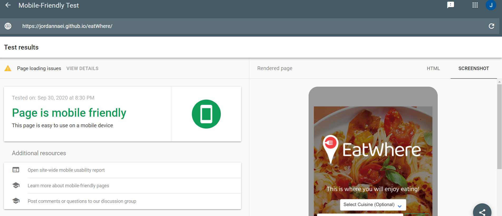
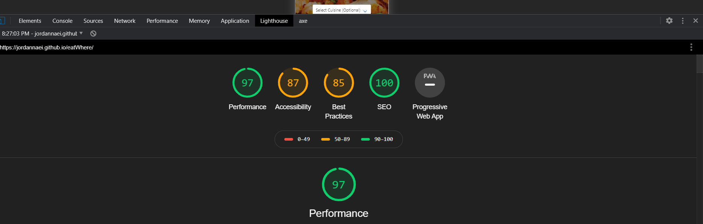

# eatWhere Application
```
This project is aiming to generate an application that allows the customer to provide a preferred cuisine or location as an input, then the Response to be represented with a list of nearby restaurants and additional information to help the client to make an informative decision as where to eat.   

to ensure the following:
    -	ensuring that people with disabilities can acccess the website.
    -	Prevent any possible litigations.
Our Dev team built the Website and optimized the html and css code to meet the client expectations. The list below identifies the changes and enhancement our Dev team applied to the code:
    1-	The usage of regular divs instead of other semantic html 5 elements, for simplicity.
    2-	Ensure that the html and css style guide criteria is met.
    5-	Generated report to the before and after website code base to exhibit the benefits of our enhancement in the following category:
    . Performance.
    . Best practices.
    . Accessibility.
    . SEO.
    6- Ensuured that the website is responsive enough to variety of view ports sizes.
    7- We included sceenshots of different reports to confirm the deliveriables. (Please check the word document attached).

```
## API Used
> Zomato APIs
  1- gecode.
  2-reviews
> ZipCodeAPI
  1- ZipCodeToLocation
> OpenWeatherAPI
> Pixabay API

## CSS Framework Used:
Bulma

## User Story

```
As a Foodie,
I want a Website to use, to be able to search nearby restaurants based on my preferred selection of either by location (city or zip-code) or cuisines (at least one form of location is required),
So that, I can make an informative decision as to where I want to eat.

```

## Acceptance Criteria

```
GIVEN EatWhere Website with form inputs
WHEN I search for a city
THEN I am presented with nearby restaurants with all cuisines’ categories.(pass)
WHEN I search a particular cuisine within a specified city.
THEN I am presented with nearby restaurants that matches that cuisine.(pass)
WHEN I search a particular cuisine within a specified city.
THEN In case no matching cuisines are available then I’m presented with a proper display message to inform me that no nearby restaurants match my criteria.(pass)
WHEN I search for a Zip code
THEN I am presented with nearby restaurants with all cuisines’ categories for that Zip Code.(pass)
WHEN I search a particular cuisine within a specified Zip Code.
THEN I am presented with nearby restaurants that matches that cuisine within that Zip Code.(pass)
WHEN I search a particular cuisine within a specified Zip Code.
THEN In case no matching cuisines are available, I’m presented with a proper display message to inform me that no nearby restaurants match my criteria.(pass)
WHEN restaurants Information is displayed
THEN I am presented with all relevant restaurant information; Rate, Night Life Index, cuisine, link to the restaurant website, and location.(pass)

```
###
Deployed application URL: https://jordannaei.github.io/codeQuiz/index.html


###
Mobile Friendly checker:


###
DevTool Test:



